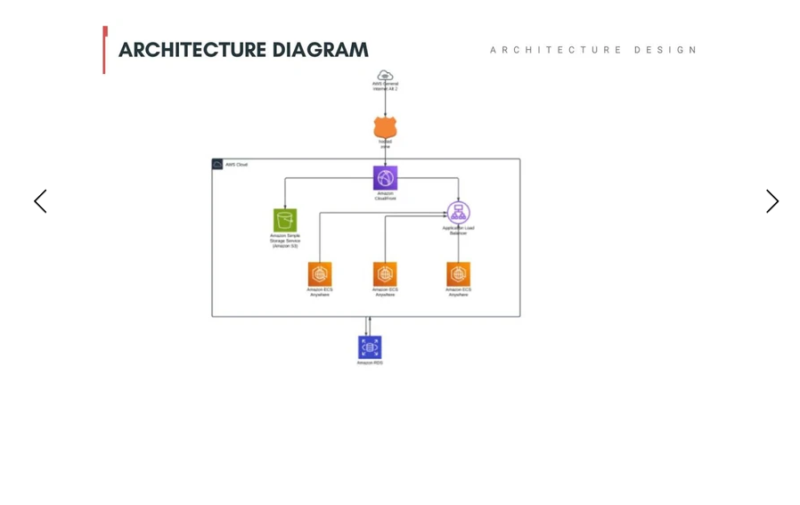

# Cloud Migration Strategy for Anonymous Survey Application

This project outlines the migration of an anonymous survey application from an on-premises server to AWS Cloud using best practices for scalability, high availability, and cost efficiency.

---

## *Solution Design*

- *Compute*: EC2 Auto Scaling Group behind an Application Load Balancer  
- *Database*: Amazon RDS (MySQL) with Multi-AZ for high availability  
- *Storage*: Amazon S3 for static files and backup  
- *Networking*: VPC with public/private subnets and NAT Gateway  
- *Security*: IAM roles, Security Groups, AWS Shield  
- *Monitoring*: CloudWatch for real-time logs and alerts  

---

## *Architecture Diagram*

---

## *Key Deliverables*

- Cloud infrastructure design and migration plan  
- Resilient and scalable cloud architecture  
- Security best practices and compliance alignment  
- Performance optimization and cost control  
- Documentation and migration checklist  

---

## *Project Outcome*

- Reduced latency and improved uptime  
- Streamlined deployment pipeline  
- Scalable database layer with automated backups  
- Improved monitoring and incident response  

---

## *Skills Demonstrated*

- AWS Cloud Architecture  
- Infrastructure as Code (IaC) – Terraform or CloudFormation  
- DevOps practices: CI/CD, Monitoring, Security  
- Cloud Migration Strategy  
- Documentation and GitHub project presentation